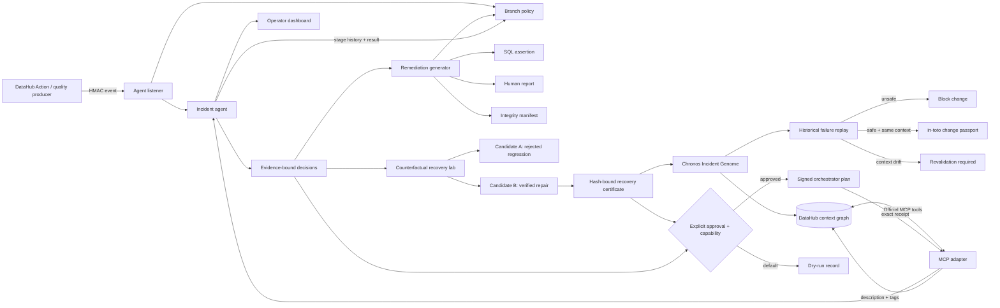

# Architecture

DataHub is the system of context and institutional memory. The safety authority is deterministic so
the same evidence produces the same decision: confirmed field dependency can contain, complete field
exclusion can continue, metadata indication can only monitor, and insufficient evidence requires
review. This deliberate constraint prevents probabilistic inference from authorizing unsafe
continuation.

Recovery is a second evidence gate, not the inverse of containment. An isolated SQLite shadow
reproduces the failure and tests two reviewable SQL candidates. A candidate receives a recovery
certificate only if it fixes the target while preserving row count, non-target identity, trusted
replacement coverage, and the governed business total. The certificate binds the exact incident,
context, SQL, output, and checks; explicit approval remains necessary to release anything.

Chronos closes the time dimension. It compiles the incident, recovery proof, historical fixture, and
DataHub schema/lineage/governance fingerprint into an Incident Genome. Typed future changes replay
the learned failure: unsafe recurrence is blocked, an unchanged safe context receives an unsigned
in-toto-shaped passport, and context drift expires proof. The passport means eligibility for
approval, never deployment authority.

The agent is a durable state machine rather than a chatbot. It authenticates and deduplicates an
event, calls DataHub tools for context, decides, generates evidence, optionally sends an atomic
fail-closed control plan, writes approved context to DataHub, and stores the exact result for the next
delivery or operator. Separate event, enforcement, and DataHub credentials preserve least privilege.
