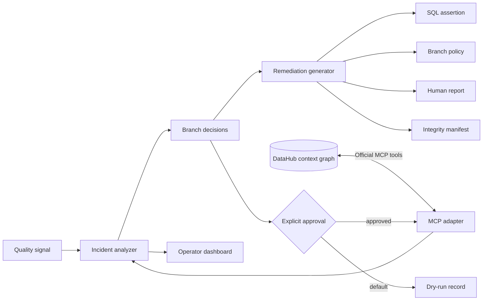

# Architecture

DataHub is the system of context and institutional memory. The analyzer is deterministic so the same
evidence always produces the same decision. MCP is the interoperability boundary; source-system
changes remain reviewable artifacts. The approval gate prevents an analysis permission from silently
becoming a write permission.
