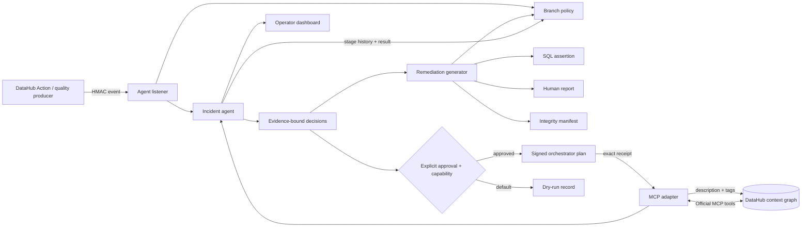

# Architecture

DataHub is the system of context and institutional memory. The safety authority is deterministic so
the same evidence produces the same decision: confirmed field dependency can contain, complete field
exclusion can continue, metadata indication can only monitor, and insufficient evidence requires
review. This deliberate constraint prevents probabilistic inference from authorizing unsafe
continuation.

The agent is a durable state machine rather than a chatbot. It authenticates and deduplicates an
event, calls DataHub tools for context, decides, generates evidence, optionally sends an atomic
fail-closed control plan, writes approved context to DataHub, and stores the exact result for the next
delivery or operator. Separate event, enforcement, and DataHub credentials preserve least privilege.
